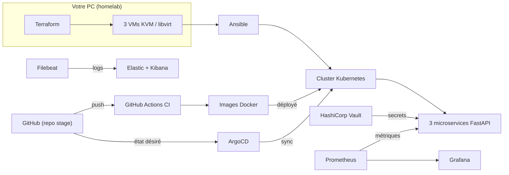
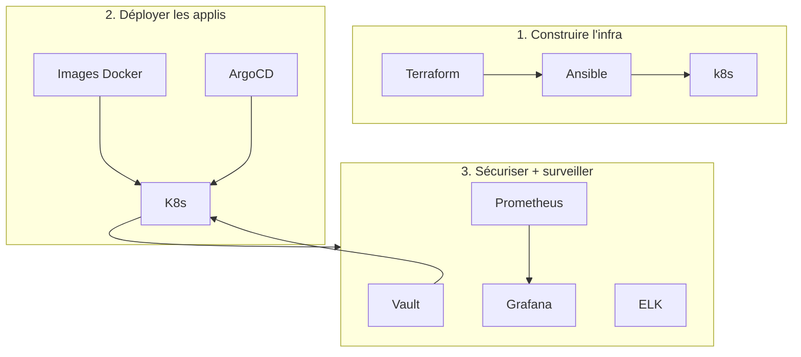
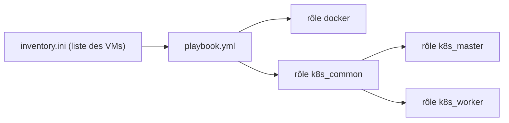
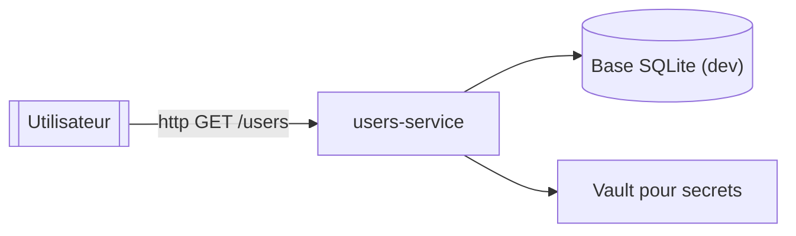
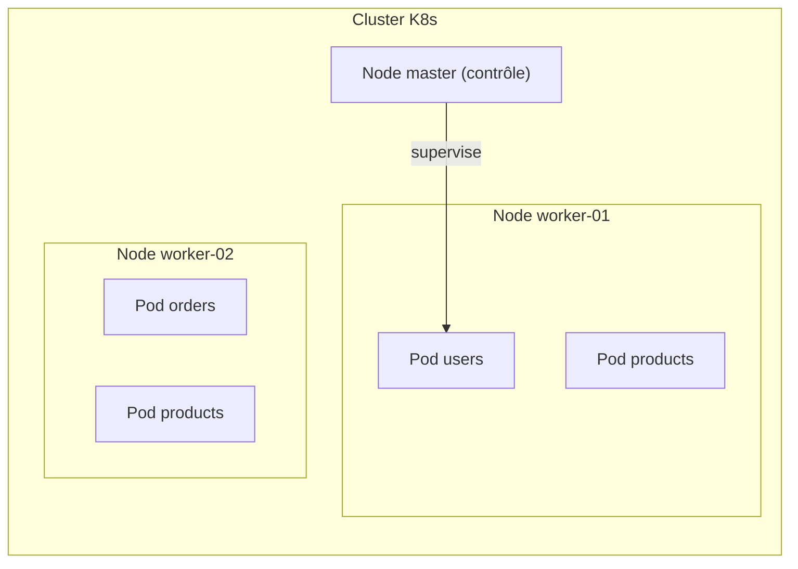
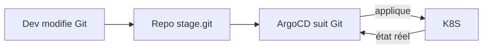
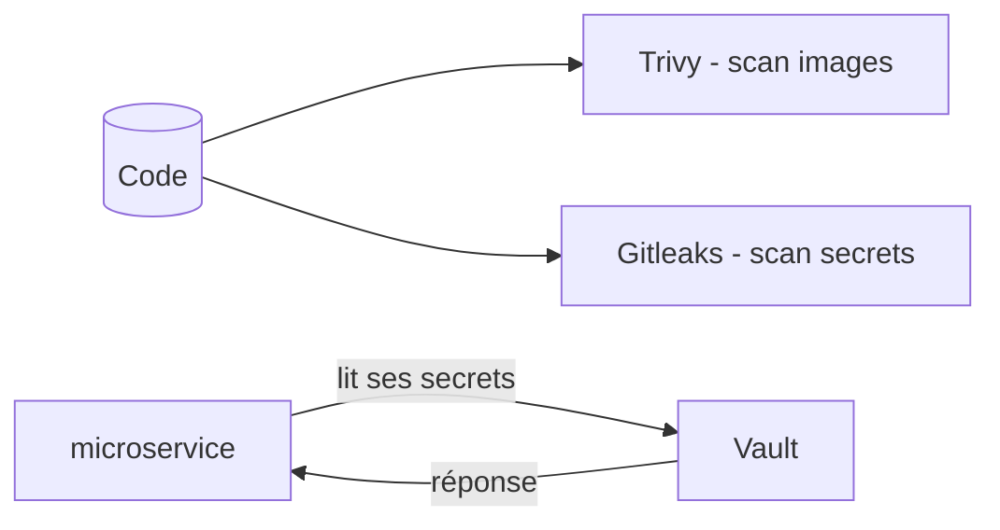
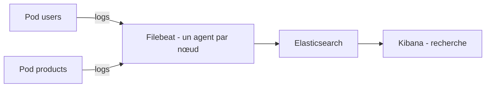
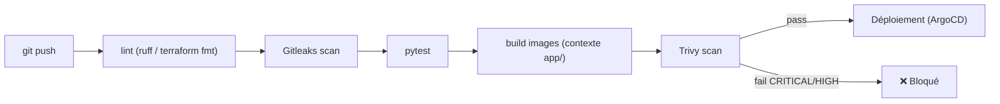

# Comprendre le projet DevOps Central Platform

> Guide simple pour comprendre **quoi** fait chaque outil et **comment ils s'assemblent**.
> Graphes Mermaid = rendus automatiquement sur GitHub et la plupart des éditeurs.

---

## 1. L'idée en une phrase

> On provisionne 3 machines virtuelles, on installe Kubernetes dessus, on y déploie 3 mini-sites (API), on sécurise le tout, on surveille tout ce qui bouge — et Git automatise toute la chaîne.

```
    ┌───────────┐   ┌──────────────┐   ┌─────────────────────────┐
    │ Terraform │ → │   Ansible    │ → │   Kubernetes (3 VMs)    │
    │  crée VMs │   │ installe K8s │   │ ┌─────┬─────┬────────┐  │
    └───────────┘   └──────────────┘   │ apps│monit│services│  │
                                        └─────┴─────┴────────┘  │
                                                     ↑          │
    ┌──────────────────┐          ┌──────────┐       │          │
    │ GitHub Actions CI│  push →  │  ArgoCD  │ ─sync─┘          │
    └──────────────────┘          └──────────┘
```

---

## 2. La chaîne complète (déploiement)



---

## 3. Les 3 couches du projet



- **A — L'infra** : Terraform crée les VMs, Ansible y installe Kubernetes.
- **B — Les apps** : 3 services Python tournent dans K8s, ArgoCD les synchronise depuis Git.
- **C — Observabilité + sécurité** : métriques, logs, secrets.

---

## 4. Outil par outil — simple + comment ça marche

### Phase 1 — Construire l'infra

#### Terraform — le "maçon de l'infra"

Crée des **machines virtuelles** (VMs) sur votre PC via KVM/libvirt.

- Vous décrivez ce que vous voulez dans des fichiers `.tf` : *"3 VMs, 2 CPU, 4 Go RAM, réseau privé 192.168.56.0/24"*.
- Terraform lit le fichier, compare avec la réalité, puis **crée/détruit pour que la réalité corresponde au fichier**.
- Il stocke son état ("state") dans `terraform.tfstate`. ⚠️ Jamais committé : contient la clé SSH.
- Problème résolu : ne jamais créer les VMs à la main.

```
  .tf  (ce que je veux)  +  state  (ce qui existe)  =  Terraform décide quoi faire
```

#### Ansible — l'installateur

Se connecte en SSH sur les VMs créées par Terraform et **installe les logiciels** (Docker, Kubernetes).

- Écrit en YAML, **idempotent** : "si c'est déjà fait, on ne refait pas".
- Rôles : `docker`, `k8s_common`, `k8s_master`, `k8s_worker` (installation), `k8s_reset` (efface tout — opt-in ⚠️).



#### Molecule — le contrôle qualité des rôles Ansible

Teste un rôle Ansible dans un **conteneur Docker jetable**, sans toucher aux vraies VMs.

### Phase 2 — Les applications (Python)

#### FastAPI — l'auteur d'API

Framework Python. En quelques lignes, il expose des **URL/API** (`/users`, `/products`, `/orders`) qui répondent en JSON. Chaque microservice a 5 routes :

| Route | Rôle |
|---|---|
| `/` | métadonnées |
| `/livez` | "suis-je en vie ?" (200 toujours) |
| `/readyz` | "puis-je recevoir du trafic ?" (503 si Vault injoignable) |
| `/metrics` | métriques pour Prometheus |
| `/users` (etc.) | les vraies données (mock pour l'instant) |



#### uvicorn — le serveur HTTP

Exécute FastAPI et écoute le réseau sur le port 8000.

#### hvac — le client Python de Vault

Bibliothèque qui connecte Vault pour lire les secrets (`DATABASE_URL`, clés JWT...). **Fail-closed** : si un secret est introuvable, l'app **refuse de démarrer** (on ne met jamais de mot de passe bidon en production).

#### prometheus-fastapi-instrumentator — le compteur automatique

Ajoute des compteurs (requêtes/sec, latence, statut HTTP) sur `/metrics` pour que Prometheus puisse les collecter.

#### python-json-logger — les formats

Formate les logs en **JSON** pour qu'Elasticsearch / Loki puissent les lire.

### Phase 3 — Kubernetes (orchestration)

#### Kubernetes (k8s) — le chef d'orchestre de containers

Avec beaucoup de containers, il faut : redémarrer les crashés, scaler, gérer le réseau. K8s gère ça : vous dites *"je veux 2 copies du users-service"* → il en crée 2 et les maintient.



Concepts clés :

- **Pod** = un container en vie.
- **Deployment** = nombre de copies + mise à jour sans interruption (Rollout).
- **Service** = adresse (IP) fixe vers les pods.
- **Namespace** = boîte de rangement (devops-platform, monitoring, vault).

#### kustomize / Helm — les organiseurs de manifests

- **kustomize** : base commune + overlays (dev/staging/prod) → même YAML, adapté à chaque environnement.
- **Helm** : packages K8s prêts à l'emploi (charts). Utilisé pour Prometheus, Grafana, etc. + un fichier de valeurs.

### Phase 4 — GitOps

#### ArgoCD — la "sourçade Git"

Git = source de vérité. ArgoCD regarde dans Git l'état voulu et **applique au cluster**. Pour modifier l'app → vous modifiez Git, ArgoCD prend le relais. Auto-heal si un pod disparaît.



### Phase 4 — Sécurité (DevSecOps)

| Outil | Que fait-il ? | En une image |
|---|---|---|
| **HashiCorp Vault** | Coffre de secrets (mots de passe, clés). Les apps viennent **lire leurs secrets au démarrage**. Fail-closed. | 🔐 secrets → apps |
| **Trivy** | Scan les images Docker pour **vulnérabilités CVE**. Si CRITICAL/HIGH → pipeline bloqué. | 🔍 image → rapport |
| **Gitleaks** | Scan le code et l'historique Git pour **secrets écrits en dur**. | 🕵️ git log → alertes |
| **pip-audit** | Vérifie les versions des bibliothèques Python contre les vulnérabilités connues. | 📋 requirements → CVE |



### Phase 5 — Observabilité

#### Prometheus — le collecteur de métriques

Interroge chaque app sur `/metrics` toutes les 15 secondes et stocke les séries temporelles (CPU, requêtes, latences...).

```
Prometheus ── scrape 15s ──→ users-service/metrics
     ↓
  stockage TSDB
```

#### Grafana — le tableau de bord

Lit les données de Prometheus et les affiche dans des **dashboards** visuels (latence, erreurs, CPU). Le projet en a 3-4 provisionnés.

```
Prometheus → Grafana → dashboards
```

#### ELK — la traque des logs

- **Filebeat** (un agent sur chaque nœud) : collecte les logs des containers.
- **Elasticsearch** : stocke et indexe les logs.
- **Kibana** : interface de recherche visuelle.



> ⚠️ **Échec actuel** : Filebeat ne tourne que sur **1/3** nœuds → les logs ne sont pas indexés pour tout le cluster.

#### Alertmanager — l'alerteur

Règles SLO : *"disponibilité ≥ 99.9%"*, *"P95 < 200 ms"*, *"erreurs 5xx < 1%"*. Si violation → alerte.

### Phase 6 — CI/CD

#### GitHub Actions — le pipeline automatique

À chaque `push` : lint → gitleaks → tests → build images → trivy → (déploiement prod manuel).



#### pre-commit — check rapide "avant le commit"

Exécuté localement avant chaque commit : ruff, yamllint, gitleaks, terraform fmt.

---

## 7. Une nouvelle fonctionnalité : le parcours

```
1. Dev écrit du code (FastAPI / YAML k8s / Terraform)
        ↓
2. pre-commit vérifie (quelques secondes)
        ↓
3. git push → GitHub Actions (lint + test + build + trivy)
        ↓
4. Image Docker publiée
        ↓
5. ArgoCD détecte le changement dans Git
        ↓
6. ArgoCD met à jour les pods dans le cluster
        ↓
7. Prometheus collecte les nouvelles métriques, Filebeat les logs
        ↓
8. Grafana / Kibana affichent (30 s plus tard)
```

---

## Tableau mémoire rapide

| Outil | Rôle | "C'est comme..." |
|---|---|---|
| Terraform | crée l'infra (VMs) | planificateur |
| Ansible | installe / configure | l'installateur |
| FastAPI | API REST | le serveur qui répond |
| uvicorn | serveur HTTP | le moteur |
| Vault | secrets | coffre-fort |
| Kubernetes | orchestration | chef d'équipe |
| Helm | paquets K8s | le magasin de templates |
| kustomize | adapte les YAML par env | variante |
| ArgoCD | Git → cluster | synchroniseur |
| Prometheus | métriques | compteur |
| Grafana | visuel | tableau de bord |
| ELK | logs centralisés | archive de logs |
| Gitleaks | scan secrets | vigile |
| Trivy | vulnérabilités images | médecin |
| pip-audit | vulnérabilités Python | la même |

---

## Pour aller plus loin

| Doc | Contenu |
|---|---|
| `docs/DevOps_Central_Platform_Description.md` | spec complète (FR) |
| `docs/DevOps_Central_Platform_Etapes_Implementation.md` | implémentation phase par phase |
| `docs/slo.md` | règle SLO |
| `docs/runbook-*.md` | astuces incidents |
| `docs/disaster-recovery.md` | reprise après catastrophe |