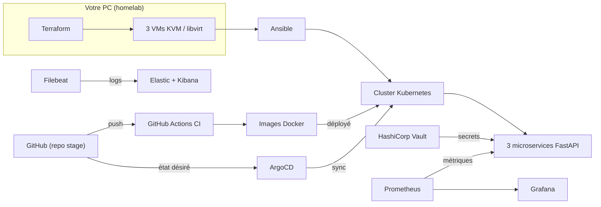
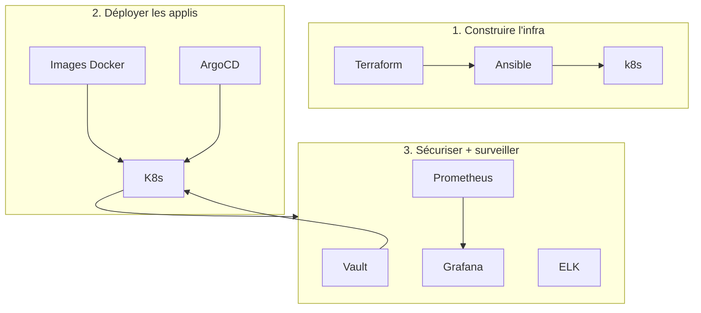
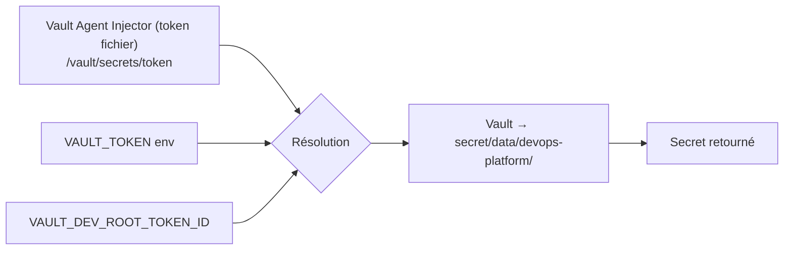
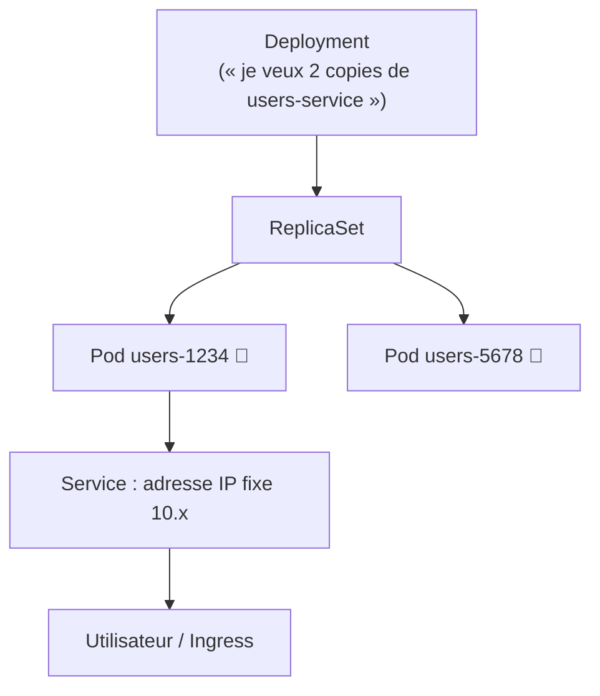
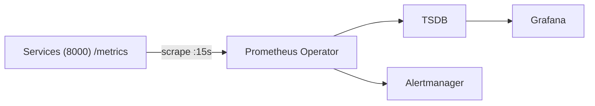
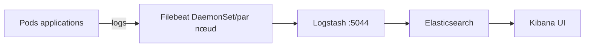
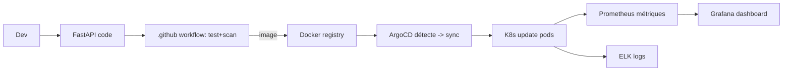

# Comprendre le projet DevOps Central Platform — guide détaillé

> Guide simple et complet pour comprendre **quoi** fait chaque outil, **comment il fonctionne**, et **comment tout s'emboîte**.
> Graphes Mermaid = rendus automatiquement sur GitHub et la plupart des éditeurs.

---

## 1. L'idée en une phrase

> On provisionne 3 machines virtuelles, on installe Kubernetes dessus, on y déploie 3 mini-sites (API), on sécurise le tout, on surveille tout ce qui bouge — et Git automatise toute la chaîne.

```
    ┌───────────┐   ┌──────────────┐   ┌─────────────────────────┐
    │ Terraform │ → │   Ansible    │ → │   Kubernetes (3 VMs)    │
    │  crée VMs │   │ installe K8s │   │ ┌─────┬─────┬────────┐  │
    └───────────┘   └──────────────┘   │ apps│monit│services│  │
                                        └─────┴─────┴────────┘  │
                                                     ↑          │
    ┌──────────────────┐          ┌──────────┐       │          │
    │ GitHub Actions CI│  push →  │  ArgoCD  │ ─sync─┘          │
    └──────────────────┘          └──────────┘
```

---

## 2. Cartographier le repo : où est quoi ?

```
stage/
├── terraform/            → crée les VMs libvirt (réseau, disques, cloud-init, inventory)
│   ├── main.tf           → ressources (network, volumes, domains, inventory)
│   ├── variables.tf      → réglages (RAM, CPU, CIDR, clé SSH, taille disque)
│   ├── outputs.tf        → IPs master/workers + inventaire
│   └── inventory.generated.ini → inventaire Ansible *généré* (tmp)
├── ansible/
│   ├── playbook.yml      → orchestration : docker → k8s_common → master → worker
│   ├── roles/            → docker, k8s_common, k8s_master, k8s_worker, k8s_reset
│   ├── group_vars/all.yml→ versions k8s (1.28), CIDRs pod/service, endpoint containerd
│   └── inventory.ini     → liste des VMs (régénérée, jamais éditée à la main)
├── app/
│   ├── users-service/    → API Python n°1 (routes /, /livez, /readyz, /metrics, /users)
│   ├── products-service/ → API Python n°2
│   ├── orders-service/   → API Python n°3
│   └── shared/           → lib commune : client Vault, logs JSON (config, log_config, vault_client)
├── k8s/
│   ├── apps/             → déploiements des 3 services : base/ + users/ + products/ + orders/
│   │   ├── base/         → Namespace, NetworkPolicies, PDB, RBAC (SA/Role), HPA
│   │   └── overlays/     → dev/, staging/, prod/ (variation par environnement)
│   ├── monitoring/       → Prometheus Operator, Grafana + dashboards, ELK, Alertmanager
│   ├── vault/            → Helm values Vault (dev mode), secrets manifests
│   ├── argocd/           → GitOps (install, project, 11 Applications)
│   └── policies/         → règles de sécurité : conftest (rego) + kyverno (digest-pin)
├── scripts/              → validate-platform.sh, smoke-test.sh, bootstrap-vault-secret.sh, ...
├── .github/workflows/ci-cd.yml → pipeline CI/CD (8 jobs)
└── docs/                 → specs FR + runbooks + ce guide
```

---

## 3. La chaîne complète (déploiement)



---

## 4. Les 3 couches du projet



- **A — L'infra** : Terraform crée les VMs, Ansible y installe Kubernetes.
- **B — Les apps** : 3 API Python tournent dans K8s, ArgoCD les synchronise depuis Git.
- **C — Observabilité + sécurité** : métriques, logs, secrets.

---

## 5. Outil par outil — comment ça marche en détail

### ──────────────────────────────
### 5.1 Terraform — le constructeur VMs
### ──────────────────────────────

**Objectif** : créer, configurer et détruire proprement tous les serveurs virtuels (VMs) du labo.

**Comment il marche** (fichiers : `terraform/*.tf`) :

1. Vous décrivez la cible dans des fichiers `.tf` :

```hcl
resource "libvirt_network" "platform" {
  name = "devops-platform-net"
  # réseau privé NAT : 192.168.56.0/24, DNS devops.local, DHCP .100-.200
}

resource "libvirt_domain" "node" {
  for_each = local.nodes
  name     = each.key          # master-01, worker-01, worker-02...
  memory   = var.vm_memory_mb  # 4096 Mo
  vcpu     = var.vm_vcpu       # 2 CPU
  # stockage → disque volume qcow2 20 Go
  # réseau → carte virtio de platform
}
```

2. `terraform init` installe les modules/providers (libvirt+local).
3. `terraform plan` affiche "je vais créer X, modifier Y, supprimer Z" (sans rien toucher).
4. `terraform apply` exécute le plan réellement.
5. `terraform state` garde la trace : c'est lui qui se souvient "à quelles IP sont les VMs".

**Fichiers concernés ici** :
- `terraform/main.tf` → les ressources : réseau, volumes (disques), domains (VMs), inventory.
- `terraform/variables.tf` → tous les réglages (RAM, CPU, CIDR, user SSH...).
- `terraform/outputs.tf` → IPs des nœuds (master/workers) et inventaire généré.
- `terraform/backend.tf` → où stocker l'état (local pour homelab, S3+DynamoDB / CI).
- `terraform/inventory.tpl` + `inventory.generated.ini` → génère `ansible/inventory.ini` (la liste des VMs utilisée par Ansible).

**Réglages clés** (toutes dans `terraform/variables.tf`) :

| Variable | Défaut | Rôle |
|---|---|---|
| `worker_count` | 2 | nombre de nœuds worker (1..32) |
| `vm_vcpu` | 2 | vCPU par VM (1..16) |
| `vm_memory_mb` | **4096** | Mo par VM — 2048 ne suffisait pas : kubelet d'un worker passait `NodeStatusUnknown` sous pression mémoire (ELK + ArgoCD + monitoring ensemble) |
| `disk_size_gb` | 20 | disque qcow2 par VM (8..1024) |
| `network_cidr` | 192.168.56.0/24 | réseau privé NAT (validé RFC1918) |
| `ssh_user` | devops | user cloud-init, clé SSH |
| `ssh_public_key` | `null` | auto-détecté `~/.ssh/id_ed25519.pub` sinon `id_rsa.pub` ; un `precondition` bloque `apply` si aucune clé n'est trouvée |

**Déroulé précis d'un `terraform apply`** :
1. `ssh_public_key` résolu (var explicite → clé auto-détectée → échec contrôlé).
2. `libvirt_network` : réseau NAT privé avec DHCP (100–200), DNS local `devops.local` + forwarders externes (`1.1.1.1`, `8.8.8.8`).
3. `libvirt_volume.base` : clone de l'image cloud Ubuntu (qcow2).
4. `libvirt_domain.node` × 3 (master-01 + worker-01/02) : disque virtio + CD-ROM cloud-init, console pty, VNC sur localhost.
5. `libvirt_cloudinit_disk` : user-data (hostname, clé SSH) + network-config (IP statique .10 / .11 / .12).
6. `local_file.ansible_inventory` : rend `inventory.generated.ini` via template.
7. `ssh_key_guard` (terraform_data) : precondition qui bloque l'apply si pas de clé SSH.

**Sorties utiles** :
```bash
cd terraform && terraform init && terraform apply   # créer le labo
terraform output                                    # IPs des nœuds
scripts/generate-inventory.sh                      # régénère l'inventaire Ansible depuis l'état réel
```

> ⚠️ `terraform.tfstate` contient la clé SSH en clair → **jamais committé** (fichier dans .gitignore + autorisé dans .gitleaks.toml en defense-in-depth). `*.tfvars` aussi ignorés : ce sont vos valeurs locales (IP, user). `inventory.generated.ini` remplace un commit de `inventory.ini` : la régénération passe par `generate-inventory.sh` (`terraform refresh` + `apply -target`), jamais à la main.

---

### ──────────────────────────────
### 5.2 Ansible (la config des serveurs)
### ──────────────────────────────

**Fichier** : `ansible/*.yml`, `ansible/roles/...`

**Rôle** : une fois les VMs créées par Terraform, Ansible se connecte en SSH et **prépare l'environnement** : installe Docker, containerd, et met en place le cluster Kubernetes (nœud maître + worker qui le rejoignent).

**Comment ça marche** :

1. `ansible.cfg` → se connecte en SSH avec `devops`, clé `~/.ssh/id_ed25519`, pipelining activé. Utilise `inventory.ini` (liste des VMs).
2. `playbook.yml` → suite d'étapes (plays), chacune ciblant des hôtes :
   - tous les nœuds : installe **Docker** (rôle `docker`)
   - tous les nœuds : prérequis K8s (rôle `k8s_common`) : swap off, modules `overlay`+`br_netfilter`, sysctl bridge-nf, install kubelet/kubeadm/kubectl **verrouillée** (`hold`)
   - nœuds `masters` : initie le cluster (rôle `k8s_master`)
   - nœuds `workers` : joignent le cluster (`serial: 1` → un par un pour stabilité)
   - (option) `k8s_reset` : **détruit** le cluster — opt-in via `--tags reset -e reset_confirmed=true`

**Que fait exactement chaque rôle** :

| Rôle | Étapes clés (fichier : `ansible/roles/<rôle>/tasks/main.yml`) |
|---|---|
| `docker` | apt docker-ce + containerd.io, tuning daemon.json, service docker démarré + activé |
| `k8s_common` | `swapoff` + fstab commenté, modprobe `overlay`/`br_netfilter` persisté, sysctl `net.bridge` + `ip_forward`, repo apt K8s (clé GPG déarmorée), kubelet/kubeadm/kubectl `1.28.*` puis `dpkg hold` (pas d'auto-upgrade), kubelet activé |
| `k8s_master` | `kubeadm init` (`--skip-phases=addon/coredns,addon/kube-proxy`), config admin copiée vers `devops`, attente API server, installation des addons, télécharge puis installe **Calico** (Tigera operator, server-side apply), génère la commande de join (token, `no_log` pour ne pas fuiter le token dans les logs CI), la dépose sur le master |
| `k8s_worker` | lit la commande join depuis le master (slurp), la valide (`assert` "kubeadm join"), l'exécute (`creates` → idempotent), redémarre kubelet, attend le nœud `Ready` |
| `k8s_reset` | `kubeadm reset` + purge — ne tourne que si `-e reset_confirmed=true` ET tag `reset,never` explicites |

**Versions** (`group_vars/all.yml`) : k8s `1.28`, Calico `v3.26.1`, pod CIDR `192.168.0.0/16`, service CIDR `10.96.0.0/12`, CRI `containerd`. `serial: 1` sur les workers = les membres rejoignent un par un, jamais en masse (stabilité du token bootstrap).

**Idempotence** = si vous relancez, il ne refait que ce qui a changé (les tâches `creates`/`command`/`selections hold` ne rejouent rien).

**Commandes utiles** :
```bash
cd ansible
ansible-playbook playbook.yml                 # tout installer
ansible-playbook playbook.yml --tags docker   # juste Docker
ansible-playbook playbook.yml --tags reset -e reset_confirmed=true  # tout casser (⚠️)
ansible-galaxy collection install -r requirements.yml  # installe community.general
ansible-inventory --list                       # voir l'inventaire résolu (hosts + groups)
```

---

### ──────────────────────────────
### 5.3 Molecule (test des rôles Ansible)
### ──────────────────────────────

**But** : vérifier qu'un rôle Ansible s'exécute sans erreur, dans un **conteneur Docker jetable**, avant de l'appliquer sur les VMs réelles.

Chaque rôle possède son scénario dans `ansible/roles/<rôle>/molecule/default/molecule.yml`. Seuls `docker` et `k8s_common` sont testables en conteneur ; `k8s_master` / `k8s_worker` requièrent un vrai cluster (driver *delegated*), donc pas de scénario Molecule.

```yaml
driver: docker
platforms:
  - name: molecule-docker
    image: geerlingguy/docker-ubuntu2404-ansible:latest
    pre_build_image: true
provisioner:
  config_options:
    defaults:
      interpreter_python: auto_silent
verifier:
  name: ansible
```

```bash
pip install molecule[docker] ansible-lint
molecule test -s docker --all        # exécute tous les scénarios : lint → converge → verify → destroy
```

Dans CI, le job lint invoque `molecule test --all` — si un rôle se casse, la PR est rejetée avant promotion.

---

### ──────────────────────────────
### 5.4 FastAPI (l'API)
### ──────────────────────────────

**Fichier** : `app/users-service/main.py` (idem pour products/orders).

**But** : exposer des **endpoints HTTP** répondant du JSON. Chaque service a :

| Route | Ce que ça retourne |
|---|---|
| `GET /` | infos du service + `vault_configured` |
| `GET /livez` | `{"status":"alive"}` — sonde de vie K8s |
| `GET /readyz` | 200 si Vault accessible, sinon 503 — sonde de readiness |
| `GET /metrics` | métriques pour Prometheus |
| `GET /users` (etc.) | les données / API |

**Rouage interne** :
1. `app = FastAPI(title=...)` instancie l'app.
2. `Instrumentator(...)` de prometheus instrumente l'app : compteurs de requêtes, latence (histogrammes par bucket), buckets de durées. Il **exclut volontairement** les sondes (`/livez`, `/readyz`, `/metrics`) pour ne pas fausser les SLO prévus.
3. `_load_secrets()` s'exécute **au chargement du module** (démarrage) : va chercher `DATABASE_URL` et `JWT_SECRET_KEY` via `get_secret()`. Fail-closed : si absent en production → `SystemExit` (le pod refusant de démarrer) ; en dev → fallback `sqlite:///file::memory:` + JWT éphémère (`secrets.token_hex`).
4. `VAULT_CONFIGURED = bool(os.environ.get("VAULT_ADDR"))` → exposé sur `GET /`.
5. `uvicorn` fait tourner l'app : `python -m uvicorn main:app --host 0.0.0.0 --port 8000`.

**Exemple réel d'endpoint** :

```python
@app.get("/users")
def list_users():
    return [{"id": 1, "name": "Alice"}, {"id": 2, "name": "Bob"}]
```

**Sondes réelles** (`/readyz` ≠ `/livez`) :

```python
@app.get("/readyz")
def readyz():
    health = vault_health()   # léger : jamais d'exception, jamais de secret
    return JSONResponse(
        status_code=200 if health.get("reachable") else 503,
        content={"service": "users", "vault": health},
    )
```

- `/livez` : vérifie juste que le process tourne → sonde **liveness**.
- `/readyz` : vérifie que Vault est joignable → sonde **readiness**. Si Vault tombe, le pod reste « vivant mais pas prêt » : il n'est plus dans les endpoints du Service, aucun trafic ne lui est envoyé, mais Kubernetes ne le redémarre pas (l'échec est explicite plutôt qu'une dégradation silencieuse).

---

### ──────────────────────────────
### 5.5 Vault (le coffre-fort de secrets)
### ──────────────────────────────

**Fichiers** : `app/shared/vault_client.py`, `k8s/vault/*`, `scripts/bootstrap-vault-secret.sh`.

**But** : stocker les secrets (mots de passe DB, clés JWT, APiKEY) dans un coffre : les apps ne gardent AUCUN secret en dur — elles le demandent à Vault au démarrage.

**Ordre de résolution d'un secret** :



**Options clés** :
- **Token** : résolu dans le code `app/shared/vault_client.py::_vault_token()` — dans l'ordre :
  1. `/vault/secrets/token` (fichier monté par **Vault Agent Injector**, token court-vécu, jetable par pod) ;
  2. `VAULT_TOKEN` (environnement — chemin dev, déconseillé en prod) ;
  3. `VAULT_DEV_ROOT_TOKEN_ID` (fallback dev mode seulement).
  Si rien → `SecretUnavailable` (fail-closed).
- **Path** : `secret/data/devops-platform/<svc>` (KV v2), construit depuis `SERVICE_NAME`.
- **Cache `@lru_cache(maxsize=1)`** : un seul `client.read()` par process ; `get_secret("DATABASE_URL")` puis `get_secret("JWT_SECRET_KEY")` ne déclenchent qu'**un** fetch. `reload_secrets()` purge le cache (rotation de token, tests).
- **`vault_health()`** : vérifie `client.is_authenticated()` ; retourne toujours un dict (jamais d'exception levée) → propulsé par `/readyz`.

**Ordre de résolution `get_secret(name)`** (`vault_client.py`) :
1. Vault (path du service) — si Vault répond, le secret prime ;
2. env var du même nom (chemin dev-local) ;
3. `default=` explicite (uniquement valeurs non sensibles, loggées `secret.default_used`) ;
4. sinon → **`SecretUnavailable` levée**. Vault injoignable ⇒ env ⇒ default ⇒ erreur — jamais de placeholder opaque.

**Fail-closed** (logique de sécurité) :
```python
if not DATABASE_URL:      # pas de DB trouvée
    if is_dev:  DATABASE_URL = "sqlite:///..."        # marche en dev
    else:       raise SystemExit("pas de secret → je refuse de démarrer")
```

**Bootstrap du token (`scripts/bootstrap-vault-secret.sh`)** :
- Crée/rotte le Secret Kubernetes `vault-root-token` dans `devops-platform`.
- Le token est passé par **stdin** (`--from-file=root-token=/dev/stdin`) : il n'apparaît ni en ligne de commande (visible dans `ps`), ni sur disque, ni dans l'index Git.
- Si `VAULT_DEV_ROOT_TOKEN` est absente de l'environnement, un token aléatoire 64 hex est généré et affiché **une seule fois** (à sauver dans un gestionnaire de mots de passe).
- Rotation : re-exécuter le script ; les apps référençant le Secret via `secretKeyRef` le récupèrent au prochain redémarrage du pod.

> Vault est déployé en **dev mode** (auto-unsealed, stockage en mémoire) via Helm `k8s/vault/vault-values.yaml` — le `devRootToken` commité est un marqueur vide (`INJECT-VIA-HELM-SET...`) ; à l'installation, on passe `--set server.dev.devRootToken=<token>`. En prod = mode *standalone* raft + unseal manuel + stockage persistant.

---

### ──────────────────────────────
### 5.6 prometheus-fastapi-instrumentator + metrics
### ──────────────────────────────

Le **middleware** transforme chaque requête en statistiques prometheus :

```
/users  →  +1 (count)   +1.234ms (latence)   code 200 (bucket)
```

Toutes sont exposées sur `GET /metrics` et Prometheus les interroge.

---

### ──────────────────────────────
### 5.7 python-json-logger (logs structurées)
### ──────────────────────────────

**Fichier** : `app/shared/log_config.py`.

- Les logs partent en **ligne JSON** (`LOG_FORMAT=json` en prod → lisibles par Elasticsearch/Kibana).
- En dev : `LOG_FORMAT=plain` → lisible en humain.
- Chaque log a un `event` (`secret.default_used`, `vault.fetch`, ...) : plus facile à filtrer.

```json
{"timestamp":"...", "level":"INFO", "service":"users-service", "event":"vault.fetch", ...}
```

---

### ──────────────────────────────
### 5.8 Kubernetes (k8s) — le chef Kubernetes
### ──────────────────────────────

**Fichiers** : `k8s/apps/**`, `k8s/monitoring/**`.

**But** : orchestrer les pods — combien de répliques, les relancer, les exposer, les scaler, les surveiller.

**Déroulement** :



**Concepts de base** (à connaître) :

| Concept | Rôle |
|---|---|
| Pod | un conteneur en cours d'exécution |
| Deployment | le nombre exact de copies à maintenir (declaratif) |
| ReplicaSet | moteur qui crée / surveille les pods pour le Deployment |
| Service | point d'entrée stable (IP + DNS) vers les pods |
| Namespace | répertoire logique : `devops-platform`, `monitoring`, `vault`, `argocd` |
| ConfigMap | fichiers de configuration (non secrets) |
| Secret | champs/fichiers secrets (ex. `vault-root-token`) |
| PDB | PodDisruptionBudget : garantit qu'au moins X répliques survivent à une éviction volontaire (drain de nœud) |
| HPA | auto-scaler : CPU > 70 % (ou mémoire > 80 %) → ajoute une réplique |
| Probe | sondes `startupProbe`/`readinessProbe`/`livenessProbe` sur les endpoints `/livez` + `/readyz` |

**Exemple réel de Deployment** (`k8s/apps/users/users-deployment.yaml`) — en plus du basique, le manifest porte :

- **Sécurité par défaut** : `runAsNonRoot: true` (UID 1000), `readOnlyRootFilesystem: true` + volume `emptyDir` sur `/tmp`, `drop ["ALL"]`, `allowPrivilegeEscalation: false`, `seccompProfile: RuntimeDefault` ;
- **ServiceAccount dédié** `users-service-sa` (moindre privilège) + `automountServiceAccountToken: false` ;
- **3 sondes** : `startupProbe` (30 échecs × 5s), `readinessProbe` (`/readyz` → Vault joignable), `livenessProbe` (`/livez`) ;
- **Topologie et disponibilité** : `topologySpreadConstraints` (maxSkew 1 par nœud) + `podAntiAffinity` (2 replicas sur 2 nœuds différents) ;
- **Annotations Prometheus** : `prometheus.io/scrape: "true"`, port 8000, path `/metrics` ;
- **Env sealed** : `ENVIRONMENT=production` (fail-closed), `VAULT_ADDR` interne, `VAULT_TOKEN` via `secretKeyRef` (obligatoire → le pod refuse de démarrer sans) ;
- **RollingUpdate** : `maxSurge: 1`, `maxUnavailable: 1` — zéro downtime pendant un déploiement ;
- **Ressources** : requests 100m/128Mi, limits 250m/256Mi.

**Bonus de disponibilité `base/pdb.yaml` + `base/hpa.yaml`** : chaque service a un **PDB** `minAvailable: 1` (l'éviction volontaire ne peut pas mettre à plat toutes les répliques d'un coup) et un **HPA** `min: 2 / max: 5` avec *stabilizationWindow* : montée 30 s (scale-up rapide), descente 300 s (pas de churn).

---

### ──────────────────────────────
### 5.9 Helm (packages K8s)
### ──────────────────────────────

**But** : package une application K8s (déploiements, services, ConfigMap...) + des valeurs → chart réutilisable.

Utilisé ici pour **monitoring + secrets** :
- `k8s/monitoring/prometheus/` — wrapper chart → Prometheus **Operator** (CRD `ServiceMonitor`, `Prometheus`, `PrometheusRule`) ;
- `k8s/monitoring/grafana/` — chart Grafana (values + secret admin + datasources ConfigMap + 4 dashboards provisionnés dans `dashboards/`) ;
- `k8s/monitoring/elk/` — charts Elasticsearch / Logstash / Kibana (values) **+** Filebeat (DaemonSet custom) ;
- `k8s/vault/vault-values.yaml` — chart officiel HashiCorp Vault (dev mode + Agent Injector activé).

**Commande type** pour installer :
```bash
helm repo add hashicorp https://helm.releases.hashicorp.com
helm install vault hashicorp/vault -n vault -f k8s/vault/vault-values.yaml --create-namespace \
  --set server.dev.devRootToken="<token de scripts/bootstrap-vault-secret.sh>"
```

---

### ──────────────────────────────
### 5.10 kustomize (variation YAML)
### ──────────────────────────────

Le même dossier `k8s/apps/base/` (le "commun" : Namespace, NetworkPolicies, PDB, RBAC, HPA) + des overlays qui ajoutent/modifient. La racine `k8s/apps/kustomization.yaml` agrège `base/` + les 3 sous-kustomizations services (`users/`, `products/`, `orders/`) et **épingle** les images sur le registre `ghcr.io/<owner>/<svc>:latest`.

Différences par overlay :
- `overlays/dev/` : réplicas 2, tags mutables (`latest`) ;
- `overlays/staging/` : réplicas 2–3, tags de branche ;
- `overlays/prod/` : namespace `production`, **réplicas 3**, PDB `minAvailable: 2`, images digest-pinned (`newTag: digest-...` remplacé par le digest sha256 à l'apply) + Kyverno en audit de contrainte.

```bash
kubectl kustomize k8s/apps/overlays/prod  # fusionne base + prod
kubectl apply -k k8s/apps/overlays/dev    # applique en dev
```

---

### ──────────────────────────────
### 5.11 ArgoCD (GitOps)
### ──────────────────────────────

**But** : que Git = source de vérité. ArgoCD suit repo Git et force le cluster à correspondre.

**Comment** :
1. Dans Git, le type `Application` déclare : repo/chemin source → namespace destination + politique de sync.
2. ArgoCD `poll + sync` : il compare l'état Git vs cluster, et applique (`ServerSideApply`).
3. `selfHeal` : si quelqu'un modifie le cluster en direct, ArgoCD retient l'état Git.
4. `prune` : supprime les ressources qui n'existent plus dans Git.

Ce repo contient **11 Applications ArgoCD** (`k8s/argocd/applications/`) : une par service (`users-service`, `products-service`, `orders-service`), une pour la base du namespace (`base-app`), une pour l'install d'ArgoCD (`argocd-install-app`), et une pour chaque brique d'observabilité (Prometheus, Grafana, dashboards, ELK, Alertmanager, `slo-rules-app`, `observability-base-app`). Toutes passent par le **projet** `devops-platform` (`k8s/argocd/project.yaml`).

**Exemple de fichier réel** (`k8s/argocd/applications/users-app.yaml`) :

```yaml
apiVersion: argoproj.io/v1alpha1
kind: Application
metadata:
  name: users-service
  namespace: argocd
  finalizers:
    - resources-finalizer.argocd.argoproj.io
spec:
  project: devops-platform
  source:
    repoURL: https://github.com/<owner>/<repo>.git
    targetRevision: main
    path: k8s/apps/users
  destination:
    server: https://kubernetes.default.svc
    namespace: devops-platform
  syncPolicy:
    automated:
      prune: true
      selfHeal: true        # répare si l'état du cluster dérive de Git
      allowEmpty: false
    syncOptions:
      - CreateNamespace=true
      - ServerSideApply=true
    retry:
      limit: 5              # réessaie jusqu'à 5× avec backoff 5s→3m
      backoff:
        duration: 5s
        factor: 2
        maxDuration: 3m
```

> ⚠️ `slo-rules-app.yaml` pointe vers `alertmanager/rules.yaml` (PrometheusRule) — c'est la seule Application à viser **un fichier** au lieu d'un répertoire. Ne pas mélanger ce fichier dans un chemin répertoire : un chemin unique n'est pas traité par arborescence de répertoires.

---

### ──────────────────────────────
### 5.12 Sécurité : Vault / Trivy / Gitleaks / pip-audit / OPA
### ──────────────────────────────

#### Gitleaks (secrets dans le code)
- Scan les fichiers + l'**historique Git** (règles par défaut de gitleaks + config projet).
- **Bloquant** : si un token apparaît → CI échoue.
- config `.gitleaks.toml` : allowlist **minimale** — seuls `terraform.tfstate` (defense-in-depth : le fichier doit rester gitignoré), `.gitleaks.toml` lui-même et `files.md/*.txt` sont tolérés ; placeholders `REPLACE_ME_WITH_A_REAL_SECRET` / `YOUR_SECRET_HERE` explicitement acceptés.

**local** :
```bash
gitleaks detect --config .gitleaks.toml
gitleaks git --full-history --config .gitleaks.toml
```

#### Trivy (vulnérabilités images)
- Analyse l'image Docker couche par couche (OS + librairies, dépendances du package manager).
- Compare contre la base CVE ; classes CRITICAL/HIGH/MEDIUM/LOW.
- **Bloquant** sur CRITICAL/HIGH en CI (`--exit-code 1`), `--ignore-unfixed` activé.
- En CI : scan sur le **digest sha256** de l'image (jamais le tag mutable `:latest`) pour éviter les courses de tags.

```bash
docker build -t users-service:1.0.0 -f app/users-service/Dockerfile app/
trivy image --severity HIGH,CRITICAL --exit-code 1 --ignore-unfixed users-service:1.0.0
```

#### pip-audit (deps python)
```bash
pip-audit -r app/shared/requirements.txt -r app/users-service/requirements.txt --strict
```

#### Policy-as-code sur les manifests
Deux briques complémentaires :
- **conftest / OPA** (`k8s/policies/conftest/security.rego`) : règles `require-image-digest-pin`, `readOnlyRootFilesystem`, `drop ALL capabilities`, pas de `latest`. En CI : **audit mode** (non-bloquant) — signalement sans blocage.
- **Kyverno** (`k8s/policies/disallow-latest-images.yaml`) : `ClusterPolicy` qui valide `image: "*@sha256:*"` (digest-pin obligatoire en prod) + `restrict-security-context` (`drop: [ALL]`, `runAsNonRoot: true`). `validationFailureAction: Audit` pour l'instant → passer à `Enforce` une fois la prod migrée en digest.

---

### ──────────────────────────────
### 5.13 Observability — Prometheus / Grafana / ELK / Alertmanager
### ──────────────────────────────

#### Prometheus (Prometheus Operator)
- Operator gère `ServiceMonitor`s : les services `users-service`/`products-service`/`orders-service` sont scrapés toutes les 15 s sur `/metrics:8000`.
- Pull aussi les métriques **kube** et **node** du cluster.
- Stocke les séries dans TSDB ; **Alertmanager** reçoit les alertes ; Grafana lit les séries.



#### Grafana
- Connecté à Prometheus (datasource déclarée dans `k8s/monitoring/grafana/configmap-datasources.yaml`).
- **4 dashboards** provisionnés via ConfigMaps (`k8s/monitoring/grafana/dashboards/`) :
  `01-infra-overview`, `02-app-performance`, `03-error-rate`, `04-infra-detail`.
- Mot de passe admin Grafana : jamais codé en dur — secret créé hors Git (`k8s/monitoring/grafana/secret.yaml` + `scripts/bootstrap-elasticsearch-secret.sh`).

#### ELK (Elastic + Logstash + Kibana + Filebeat)
- **Filebeat** (DaemonSet, un pod par nœud) lit `/var/log/containers/*.log`, enrichit les logs avec les labels k8s (namespace, pod, container) via *autodiscover*, et les envoie à **Logstash :5044**.
- **Logstash** parse et redirige vers **Elasticsearch** (qui indexe).
- **Kibana** : l'interface de recherche / visualisation.



> ⚠️ Filebeat est un **DaemonSet 1 replica par nœud** : si le cluster a 3 nœuds, `kubectl get pods -n monitoring -l 'app.kubernetes.io/name=filebeat'` doit montrer 3/3 running. Un résultat « 1/3 » dans `validate-platform.sh` signifie qu'Elastic ne reçoit pas les logs des autres nœuds.

#### Alertmanager 💬
- Les `PrometheusRule` de `k8s/monitoring/alertmanager/rules.yaml` définissent les **SLO** et incidents :
  - **disponibilité** < 99.9 % sur 30 jours (`SLOAvailabilityBreach`) — recording rule `service:availability_30d:ratio` ;
  - **latence P95** > 200 ms par handler (`SLOP95LatencyBreach`) ;
  - **erreurs 5xx** > 1 % (`SLO5xxErrorRateBreach`) ;
  - incidents hors SLO : mémoire conteneur > 80 % de la limite (noisy-neighbour), pods **OOMKilled**, **HPA bloqué à `maxReplicas`** > 15 min (fuite / coût anormal).
- Seuils ré-évalués toutes les 5 min avec `for:` (durant laquelle l'alerte doit être stable avant de s'enclencher).
- En cas de violation, Alertmanager notifie (silence, slack-écho, mail...).

---

### ──────────────────────────────
### 5.14 GitHub Actions (CI)
### ──────────────────────────────

**Fichier** : `.github/workflows/ci-cd.yml`

**Déclencheurs** : `push` (sur `main`/`develop`/`clean-main`, paths limités aux dossiers pertinents), `pull_request`, `schedule` (3:00 UTC, détection de drift quotidienne), `workflow_dispatch` (déploiement prod manuel).

**Séquence des "jobs"** :

```mermaid
flowchart LR
    L[1.lint] --> G[2.gitleaks]
    G --> T[3.test + pip-audit]
    T --> B[4.build images (matrix)]
    B --> V[5.trivy scan (matrix)]
    G --> TF[terraform-validate]
    V -->|"workflow_dispatch uniquement"| D[deploy prod]
    subgraph nightly["schedule (3:00 UTC)"]
        N[load-test k6]
    end
```

Détail des jobs (chaînés avec `needs`, `fail-fast: false`) :

| # | job | Que fait-il réellement (extraits de `ci-cd.yml`) |
|---|---|---|
| 1 | `lint` | `ruff` sur `shared` + 3 services ; `terraform fmt -check -recursive` ; `yamllint` sur `k8s/` ; **kubeconform** (schémas, exclut `values.yaml`/`crds.yaml`) ; **conftest** sur les manifests (audit) |
| 2 | `gitleaks` | action gitleaks `fetch-depth: 0`, commentaires sur la PR + artefact, config `.gitleaks.toml`, **bloquant** |
| 3 | `test` | `pip-audit --strict` (deps pinées), vérif `shared` imports, pytest sous `ENVIRONMENT=dev LOG_FORMAT=plain VAULT_ADDR=""` (pas de Vault) + **import réel** de chaque service + build de test (contexte `app/`) |
| 4 | `build` | matrix 3 services, Buildx + login GHCR, **digest sha256** en sortie (pas de `latest` mutable hors branche par défaut), `cache-from/to gha`, `provenance + sbom` |
| 5 | `trivy-scan` | pull image au **digest** (anti-course de tag), scan **CRITICAL/HIGH `--exit-code 1`** + SARIF (GitHub Security tab) + SBOM (SPDX) |
| 6 | `terraform-validate` | `terraform init -backend=false` + `validate` (matrix `1.5.7` — compat `required_version ~> 1.5`) |
| 7 | `deploy` | **uniquement manuel** (`workflow_dispatch`, env protégée `production`) : `kustomize edit set image <svc>=ghcr.io/...@sha256:<digest>`, `kubectl apply --server-side`, `rollout status` (vault + 3 services), puis **smoke /metrics** (histogram `inline` dans un pod curl) |
| 8 | `load-test` | nuit : k6 contre `users-service` (résultats en artefact) |

> L'environnement `production` GitHub (réglages → Environments → « production ») impose une protection manuelle : un `workflow_dispatch` passe par une approbation, puis déploiement.

---

### ──────────────────────────────
### 5.15 pre-commit (contrôles avant commit)
### ──────────────────────────────

Contrôles locaux exécutés **avant** chaque commit (gate de premier niveau — le CI reste la source de vérité).

```bash
pip install pre-commit && pre-commit install
pre-commit run --all-files
```

Hooks configurés (`.pre-commit-config.yaml`) :
- `pre-commit-hooks` : check-yaml (documents multiples autorisés), end-of-file/trailing-whitespace fixes, check-merge-conflict, check-case-conflict, **detect-private-key** ;
- `ruff` (v0.1.9) — sert sur `app/shared/`, `app/<svc>/`, `tests/` ;
- `yamllint` (v1.33.0) — sur `k8s/` et `.github/` (line-length autorisée pour les values K8s/Helm) ;
- `gitleaks` (v8.18.0) — scan de l'historique complet avant commit (config projet `.gitleaks.toml`) ;
- `pre-commit-terraform` : `terraform_fmt` + `terraform_validate` (init sans backend) sur `terraform/*.tf`.

> En local, ces hooks tournent **avant le commit** ; en CI, les mêmes règles tournent **avec des seuils plus stricts** (ex. action gitleaks, `--exit-code 1` sur trivy).

---

### ──────────────────────────────
### 5.16 Scripts ops (validation, tests, secrets)
### ──────────────────────────────

Les scripts dans `scripts/` couvrent le cycle de vie de la plateforme :

| Script | Rôle | Usage type |
|---|---|---|
| `generate-inventory.sh` | régénère `ansible/inventory.ini` depuis l'état Terraform (`terraform refresh` + `apply -target local_file.ansible_inventory`) | après chaque changement de VMs |
| `bootstrap-vault-secret.sh` | crée/rotte le Secret `vault-root-token` **sans jamais** écrire le token sur disque/argv | `VAULT_DEV_ROOT_TOKEN="..." scripts/bootstrap-vault-secret.sh` |
| `bootstrap-elasticsearch-secret.sh` | injecte les credentials ES (Kibana/Logstash) hors Git | `scripts/bootstrap-elasticsearch-secret.sh` |
| `smoke-test.sh` | test E2E contre le cluster vivant : pods 2/2 ready, réponses `/`,`/livez`,`/data` de chaque service via port-forward, targets Prometheus up + données, Grafana health | `--ci`, `--skip-grafana` |
| `stress-hpa.sh` | test de charge `ab` : pousse `users-service` (CPU > 70 %) et vérifie que l'HPA **monte de 2 vers 5** ; observe Prometheus `http_requests_total` | `-c 200 -n 30000 --watch 240` |
| `validate-platform.sh` | 8 vérifications sur le cluster (pods, services, ingress, monitoring, Filebeat 3/3...) ; `--ci` = exit 1 si échec ; `--only 1,2,5` | par défaut **destructif** (self-heal/rollback) ; `--ci` = lecture seule + gate |
| `validate-security.sh` | 4 checks sécurité : gitleaks historique complet, trivy (images `:latest` locales), Vault initialisé + déverrouillé, token `vault-root-token` **authentifie réellement** auprès de Vault | `--ci`, `--tag 1.0.0` |

> `validate-platform.sh` est **destructif sauf `--ci`** : son mode self-heal/rollback modifie les ressources du cluster. `--skip-incident` désactive l'incident 1. Pour tester l'HPA : `scripts/stress-hpa.sh --ci` (exit 1 si aucun scale-up observé).

---

## 6. Les "fils rouges" (diagramme mental global)

### 6.1 Le flux de bout en bout d'une garantie



Chronologie temps réel (~2-3 min) :

| # | Étape | Temps |
|---|---|---|
| 1 | git push | 0s |
| 2 | CI lint / secret / test | +60s |
| 3 | build image | +120s |
| 4 | ArgoCD sync | +150s |
| 5 | déploiement pods | +180s : pods running |
| 6 | Prometheus fetch métriques | +195s (15s) |
| 7 | Grafana montre tout | ~3min30 |

### 6.2 Flow de secrets

```
Vault (installé via Helm) ─→ services demandent leurs secrets au démarrage
        │
        └──── secret/data/devops-platform/users-service
                        │
                        ▼
            users-service  (DATABASE_URL, JWT_SECRET_KEY)

mode prod : l'app refuse de démarrer si un secret est introuvable (fail-closed)
```

### 6.3 Flow des logs

```
container docker → Filebeat (par nœud) → Logstash → Elasticsearch → Kibana (recherche)
```

---

## 7. Commandes les plus utiles (à retrouver)

| commande | effet |
|---|---|
| `ENVIRONMENT=dev LOG_FORMAT=plain pytest -q tests/ -v` | lancer les tests en dev (sans Vault) |
| `ruff check app/` | lint python |
| `pre-commit run --all-files` | contrôles pré-commit |
| `scripts/validate-platform.sh --ci` | tout vérifier sur le cluster (gate) |
| `scripts/validate-security.sh --ci` | gitleaks + trivy + vault (gate) |
| `scripts/smoke-test.sh --ci` | test E2E rapide du cluster vivant |
| `scripts/stress-hpa.sh --ci` | vérifie que l'HPA scale up sous charge |
| `terraform init && terraform apply` (dans `terraform/`) | créer labo VMs |
| `ansible-playbook playbook.yml` (dans `ansible/`) | installation k8s |
| `scripts/generate-inventory.sh` | régénérer l'inventaire Ansible |
| `kubectl get pods -n devops-platform` | voir l'état des services |
| `kubectl get pods -n monitoring` | voir Prometheus/Grafana/ELK |

---

## 8. Petits "troubles", à ne pas oublier

- La plateforme requiert `ENVIRONMENT=dev` localement, sinon elle cherche Vault et sort (`SystemExit`) — c'est le **fail-closed** voulu en prod.
- Context Docker obligatoirement **`app/`** (`-f app/<svc>/Dockerfile app/`) : sinon `shared/` est invisible à l'import.
- `tests/` : présents dans Git mais **absents du working tree** de la branche active (le dossier est gitignoré/épuré localement, pas committé).
- Les secrets réels (root-token Vault, mot de passe Grafana/ES) ne sont **jamais committés** : injectés via `scripts/bootstrap-*.sh`, les manifests pointent vers un placeholder `INJECT-VIA-HELM-SET...`.
- Lint des manifests : répliquer les filtres CI — kubeconform **exclut** `values.yaml` et `crds.yaml` (`find ... ! -name`) ; les rego conftest tournent en audit.
- `terraform.tfstate` et `*.tfvars` gitignorés ; `inventory.ini` se régénère via `scripts/generate-inventory.sh`, jamais à la main.
- Memory floor : 4096 Mo/VM (`vm_memory_mb`) — 2048 a fait tomber un worker sous ELK+ArgoCD.
- Branche active localement = `remove/canary-pipeline` ; la CI déploie depuis `main` (+ `develop`/`clean-main`).

---

## 9. Tableau mémoire express

| Outil | Rôle en une ligne | "C'est comme..." |
|---|---|---|
| Terraform | crée les VMs | planification des serveurs |
| Ansible | installe / configure serveurs | assistant SSH |
| Molecule | teste les rôles Ansible | QA des playbooks |
| FastAPI | API REST | serveur qui répond JSON |
| uvicorn | fait tourner FastAPI | moteur de l'API |
| hvac | client Python Vault | clé du coffre |
| prometheus-fastapi-instrumentator | métriques automatiques | comptoir du magasin |
| python-json-logger | logs structurés JSON | journal formaté |
| Kubernetes | orchestre les containers | chef d'orchestre |
| Helm | packages K8s | apt des charts |
| kustomize | adapte le YAML par environnement | variations de config |
| ArgoCD | Git → cluster | mise à jour automatique |
| Vault | coffre de secrets | coffre-fort |
| Gitleaks | scan de tokens | vigile |
| Trivy | vulnérabilités images | laboratoire CVE |
| pip-audit | vulnérabilités pip | CTRL+F des CVE |
| Prometheus | métriques | compteur |
| Grafana | dashboards | tableau de bord |
| ELK | logs centralisés | bibliothèque de logs |
| Alertmanager | alertes SLO | le gardien qui sonne |
| k6 | test de charge (nuit) | le stress test |
| GitHub Actions | CI/CD | chaîne d'usine |
| pre-commit | contrôles avant commit | badge de sécurité |

---

## Pour aller plus loin

| Doc | Contenu |
|---|---|
| `docs/DevOps_Central_Platform_Description.md` | spec complète (FR) |
| `docs/DevOps_Central_Platform_Etapes_Implementation.md` | implémentation phase par phase |
| `docs/slo.md` | règles SLO |
| `docs/runbook-*.md` | petit guide d'incidents |
| `docs/disaster-recovery.md` | reprise après crash |
