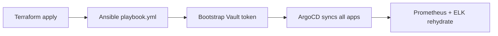

# Disaster Recovery Plan — DevOps Central Platform

## Scope

Recovery from complete cluster loss (e.g. all VMs destroyed, network
configuration lost). This covers restoring the data plane enough for
ArgoCD to self-heal the rest.

## Recovery order



## Step 1 — Infrastructure

```bash
cd terraform
terraform init
terraform apply -auto-approve
scripts/generate-inventory.sh
```

## Step 2 — Kubernetes

```bash
cd ansible
ansible-galaxy collection install -r requirements.yml
ansible-playbook playbook.yml
```

## Step 3 — Vault

```bash
scripts/bootstrap-vault-secret.sh
scripts/bootstrap-elasticsearch-secret.sh
kubectl apply -f k8s/vault/manifests.yaml
```

## Step 4 — ArgoCD bootstrap

```bash
kubectl apply -f k8s/argocd/install/
kubectl apply -f k8s/argocd/project.yaml
kubectl apply -f k8s/argocd/applications/
```

## Step 5 — Monitoring (manifests, prometheus-operator model)

Normally NOTHING is run by hand here: Step 4 installs the ArgoCD Applications
(`prometheus`, `grafana`, `alertmanager`, `slo-rules`, `observability-base`)
and they reconcile the monitoring stack themselves.

The commands below are the manual fallback for a cluster with no working
ArgoCD. They are plain `kubectl apply`, **not** `helm install` — the stack is
the prometheus-operator, because the platform is built on operator CRs
(`ServiceMonitor` from the apps chart, `PrometheusRule` from slo-rules,
`Alertmanager` from alertmanager). A community Helm chart Prometheus reads
none of those.

```bash
# CRDs first, server-side: the operator CRDs exceed the 262144-byte
# last-applied-configuration annotation limit and are rejected by a plain
# `kubectl apply` with "metadata.annotations: Too long".
kubectl apply --server-side -f k8s/monitoring/prometheus/crds.yaml

kubectl apply -f k8s/monitoring/prometheus/rbac.yaml -f k8s/monitoring/prometheus/operator.yaml
kubectl -n monitoring rollout status deploy/prometheus-operator

kubectl apply -f k8s/monitoring/prometheus/prometheus.yaml -f k8s/monitoring/prometheus/service.yaml
kubectl apply -f k8s/monitoring/alertmanager/
kubectl apply -f k8s/monitoring/grafana/ -f k8s/monitoring/kube-state-metrics/
```

HPAs need metrics-server, which is not part of the monitoring stack. Without
it every HPA reports `<unknown>` targets and ArgoCD marks the owning
Application `Degraded`:

```bash
kubectl apply -f https://github.com/kubernetes-sigs/metrics-server/releases/latest/download/components.yaml
# single-node/kind only — kubelet serving certs are self-signed there:
kubectl -n kube-system patch deployment metrics-server --type=json \
  -p '[{"op":"add","path":"/spec/template/spec/containers/0/args/-","value":"--kubelet-insecure-tls"}]'
```

ELK (`k8s/monitoring/elk/`) requires a node WITHOUT the
`node-role.kubernetes.io/control-plane` label — its pods stay `Pending` on a
single-node cluster. Deploy it only on a multi-node cluster.

## Data restore

| Service | Backup location | Restore command |
|---|---|---|
| Prometheus TSDB | `/var/lib/prometheus/` snapshot | `kubectl cp backup prometheus-0:/tmp/` |
| Elasticsearch | Snapshot repo S3 | `POST _snapshot/repo/snapshot/_restore` |
| Vault | Raft snapshot (prod) | `vault operator raft snapshot restore` |

## Post-recovery validation

```bash
scripts/validate-platform.sh
scripts/validate-security.sh
```
