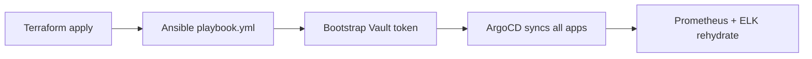

# Disaster Recovery Plan — DevOps Central Platform

## Scope

Recovery from complete cluster loss (e.g. all VMs destroyed, network
configuration lost). This covers restoring the data plane enough for
ArgoCD to self-heal the rest.

## Recovery order



## Step 1 — Infrastructure

```bash
cd terraform
terraform init
terraform apply -auto-approve
scripts/generate-inventory.sh
```

## Step 2 — Kubernetes

```bash
cd ansible
ansible-galaxy collection install -r requirements.yml
ansible-playbook playbook.yml
```

## Step 3 — Vault

```bash
scripts/bootstrap-vault-secret.sh
scripts/bootstrap-elasticsearch-secret.sh
kubectl apply -f k8s/vault/manifests.yaml
```

## Step 4 — ArgoCD bootstrap

```bash
kubectl apply -f k8s/argocd/install/
kubectl apply -f k8s/argocd/project.yaml
kubectl apply -f k8s/argocd/applications/
```

## Step 5 — Monitoring (Helm charts)

```bash
helm install prometheus prometheus-community/prometheus -f k8s/monitoring/prometheus/values.yaml -n monitoring
helm install grafana grafana/grafana -f k8s/monitoring/grafana/values.yaml -n monitoring
helm install elasticsearch elastic/elasticsearch -f k8s/monitoring/elk/elasticsearch-values.yaml -n monitoring
```

## Data restore

| Service | Backup location | Restore command |
|---|---|---|
| Prometheus TSDB | `/var/lib/prometheus/` snapshot | `kubectl cp backup prometheus-0:/tmp/` |
| Elasticsearch | Snapshot repo S3 | `POST _snapshot/repo/snapshot/_restore` |
| Vault | Raft snapshot (prod) | `vault operator raft snapshot restore` |

## Post-recovery validation

```bash
scripts/validate-platform.sh
scripts/validate-security.sh
```
